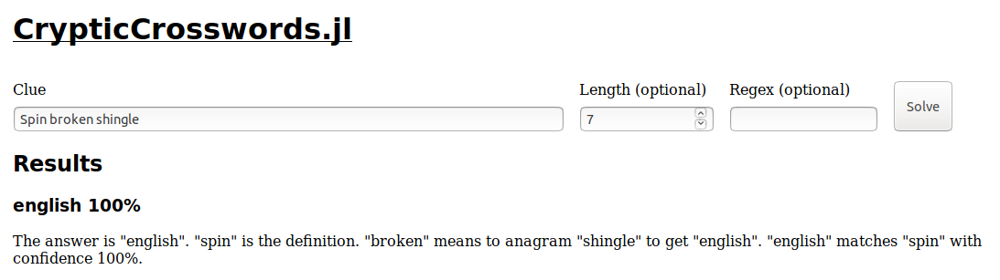
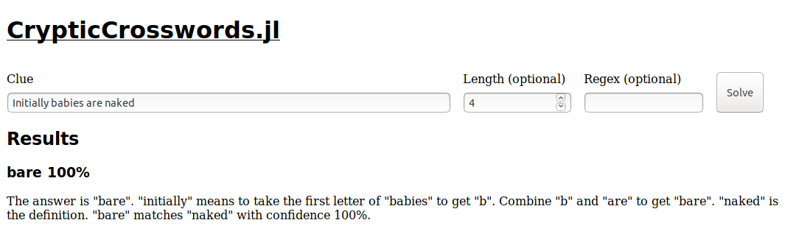
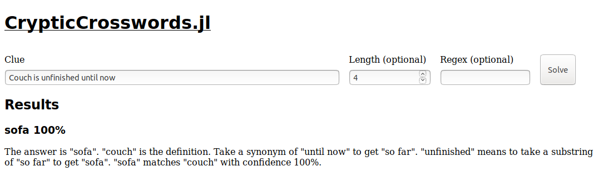
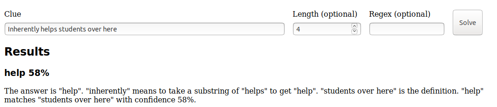

<style type="text/css">
.reveal ul {
    font-size: smaller;
}
</style>

### The Linguistics of Puzzles: Solving Cryptic Crosswords in Julia

Robin Deits

July 23, 2019

Slides: [rdeits.github.com/juliacon-2019-cryptics](http://rdeits.github.com/juliacon-2019-cryptics)

----

### Background

* Roboticist by day
    * Just finished my PhD at MIT, now at Boston Dynamics
    * Helped found the [JuliaRobotics](http://www.juliarobotics.org/) organization to develop and promote open-source robotics tools in Julia
* Puzzler by...also day
    * Helped write (with >100 of my closest friends) the [2018 MIT Mystery Hunt](https://www.mit.edu/~puzzle/2018/)
    * Helped write 13th and 15th Boston Area Puzzle Hunt League (BAPHL) puzzle hunts
    * Spent more money on escape rooms than I am willing to admit

----

### Background

* I learned about cryptic crosswords through the MIT Mystery Hunt, and I was fascinated by the way they have their own rules and vocabulary.
* Ever since I learned how to solve them myself, I've been interested in seeing if I could write a program to solve them for me.
* I wrote my first cryptic crossword solver in Python back in 2013:
    * [blog.robindeits.com/2013/02/11/a-cryptic-crossword-clue-solver/](http://blog.robindeits.com/2013/02/11/a-cryptic-crossword-clue-solver/)
* Last year, I decided to rewrite it from scratch in Julia to create a faster and more capable solver.

----

### Outline

* What is a cryptic crossword clue?
* How can we solve them automatically?
* Why was Julia a good choice?

----

### Types of Crosswords: "American"

* An typical American crossword consists of a grid of letters and clues like:
    * "Initial meetings (6)" (answer: INTROS)
    * "Naked (4)" (answer: BARE)
    * "Spin (7)" (answer: ENGLISH)
* These clues are often somewhat ambiguous:
    * "Initial meetings (6)" could also be "BRIEFS"
    * "Spin (7)" could also be "JOYRIDE"
* The primary way you disambiguate the answers is through filling out the crossword grid.

----

### Types of Crosswords: Cryptic

* Cryptic crosswords have clues which operate differently.
* Each clue points to a single answer in *two different ways*, typically by providing a *definition* and a *wordplay*, mixed together to obscure which part is which.
* This is much easier to explain by example:

----

### Cryptic Clues by Example

* Let's start with our non-cryptic clue:
    * "Initial meetings (6)" (answer: INTROS)
* A cryptic clue for this answer might look like:
    * "Initial meetings disappoint Rosemary internally (6)
* This might sound like a sentence, but that's a distraction. Instead, we need to split out the *wordplay* and the *definition*
    * In this case, "internally" is a clue to look for letters inside another phrase:
        * disappoINTROSemary &rarr; INTROS
    * The remaining words must be the definition:
        * "initial meetings" is a good definition for INTROS
* We got INTROS both from wordplay and from the definition, so it must be the answer to the clue.

----

### Cryptic Clues by Example

* Let's try another cryptic clue:
    * "Initially babies are naked (4)"
* Again, we need to find the *wordplay* and the *definition*:
* Let's start with the wordplay:
    * "initially" is a clue to take the first letter, so we take the first letter of "babies" to get B
    * We also have the word "are" in the clue, so we can combine that with B to get BARE
* Now the definition:
    * "naked" is a good definition for BARE
* Again, we have the same answer (BARE) clued in two different ways.

----

### Cryptic Clues by Example

* One more cryptic clue:
    * "Spin broken shingle (7)"
* We need to find the *wordplay* and the *definition*:
* Let's start with the wordplay:
    * "broken" is a clue to take an *anagram*, so let's take an anagram of "shingle"
    * One possible anagram of "shingle" is ENGLISH
* Now the definition:
    * "spin" is a good match for ENGLISH (in tennis, for example)
* The answer to the clue is ENGLISH, which matches the wordplay and the definition.

----

### Cryptic Clues by Example

* Now you try:
    * "Couch is unfinished until now (4)"

----

### CrypticCrosswords.jl

* CrypticCrosswords.jl is a Julia tool designed to do exactly the process I described above: breaking a cryptic clue up into its wordplay and definition and finding an answer which is a good match for both.
* It can't solve every cryptic clue, but it often does a pretty good job...
* You can find an interactive version of the solver at <http://cryptics.robindeits.com>
    * Note that this is running on a single under-powered web server, so you will get better performance running the code yourself.

----

### CrypticCrosswords.jl Demo

* Here is the top result produced by CrypticCrosswords.jl for each of the clues we've seen so far:
    * "Spin broken shingle (7)"



----

### CrypticCrosswords.jl Demo

* "Initially babies are naked (4)"



----

### CrypticCrosswords.jl Demo

* "Initial meetings disappoint Rosemary internally (6)"


----

### CrypticCrosswords.jl Demo

* "Couch is unfinished until now (4)"



----

### CrypticCrosswords.jl Demo

* Of course, the solver doesn't always work:
    * "Inherently helps students over here (4)"



* The answer should be PSST from "helPSSTudents", but the solver has no idea that PSST matches "over here".

----

### How It Works

* CrypticCrosswords.jl solves a cryptic clue by going through several steps:
    * First, we generate all of the possible ways to *parse* the clue into definition and wordplay components
    * For each possible parse, we apply the appropriate wordplay functions to see what its wordplay produces
    * We then check each possible wordplay output against the parsed definition to see if they match in meaning
    * Finally, we generate a human-readable explanation of the N best outputs (sorted by how well the wordplay matches the definition).

----

### Parsing

* The first step in solving a clue is figuring out what each of the words might do. Here are a few ways to parse the clue "They primarily play Diplomacy (4)":


----

### Parsing

* The first step in solving a clue is figuring out what each of the words might do. Here are a few ways to parse the clue "They primarily play Diplomacy (4)":


----

### Parsing

* The first step in solving a clue is figuring out what each of the words might do. Here are a few ways to parse the clue "They primarily play Diplomacy (4)":


----

### Parsing

* How do we produce all of these trees?
    * Trying to assign every possible meaning to every single word is computationally overwhelming and will produce lots of nonsense (like an anagram without a matching anagram indicator).
* Fortunately, this is actually a very well-studied problem in linguistics.

----

### Parsing Human Language

* Linguists make sense of human language by building exactly the same kinds of tree structures:


----

### Parsing

* To parse text into its possible trees, we need two things: a *grammar* and a *parser*
    * A grammar describes all of the components that can be part of a tree and how those pieces can be composed. For example:
        * clue &rarr; wordplay + definition
        * wordplay &rarr; substring
        * substring &rarr; substring indicator + literal
        * wordplay &rarr; anagram
        * anagram &rarr; anagram_indicator + literal
    * A parser takes a grammar and a list of words and produces all of the possible trees supported by that grammar

----

### Parsing Cryptic Clues

* The grammar of cryptic crosswords is particularly difficult because:
    * It is ambiguous (there are many grammatically valid ways to parse a given clue)
    * It is recursive (a wordplay can be made up of other wordplays which are in turn made up of other wordplays...).
* To support parsing this grammar, I created [rdeits/ChartParsers.jl](https://github.com/rdeits/ChartParsers.jl), featuring:
    * Top-down and bottom-up chart parsers for arbitrary grammars, implemented in pure Julia
    * Support for probabilistic grammars
    * Iterator interface for terminating parsing early

----

### Aside: Chart Parsers

* Chart parsers are a special class of parser designed to be very efficient, even for long sentences and complex grammars.
* They use dynamic programming to ensure that a given subtree is built only once, even if it is used in many other trees.
* They can also be designed to support probabilistic grammars, in which each rule in the grammar also provides a score indicating how likely it is that the rule applies to the given inputs.

----

### Parsing Cryptic Clues

* Here's what it looks like to parse a cryptic clue:

```julia
julia> using CrypticCrosswords: ChartParser, CrypticsGrammar

julia> tokens = ["spin", "broken", "shingle"];

julia> parser = ChartParser(tokens, CrypticsGrammar());

julia> collect(Iterators.take(parser, 5))
5-element Array{ChartParsers.Arc{CrypticCrosswords.Rule},1}:
 (1, 2, AnagramIndicator -> "broken"  (0.96))
 (2, 3, Token -> "shingle"  (0.034))
 (2, 3, Phrase -> "shingle"  (0.034))
 (2, 3, StraddleIndicator -> (2, 3, Phrase -> "shingle"  (0.034))  (0.034))
 (2, 3, Definition -> (2, 3, Phrase -> "shingle"  (0.034))  (0.034))
 ```

 * Each line of output is one potential subtree, along with its probability score

----

### Parsing Cryptic Clues

* We can also ask the parser to only produce *complete* parse trees:

```julia
julia> parsed_trees = collect(Iterators.take(
           Iterators.filter(is_complete(parser), parser), 2))
2-element Array{ChartParsers.Arc{CrypticCrosswords.Rule},1}:
 (0, 3, Clue ->
    (0, 1, Definition -> (0, 1, Phrase -> "spin"  (0.034))  (0.034))
    (1, 3, Wordplay ->
        (1, 3, Anagram ->
            (1, 2, AnagramIndicator -> "broken"  (0.96))
            (2, 3, JoinedPhrase -> (2, 3, Literal -> "shingle"  (0.034))  (0.034))  (0.017))  (0.00096))  (0.00024))
 (0, 3, Clue ->
    (0, 2, Wordplay ->
        (0, 2, Anagram ->
            (0, 1, JoinedPhrase -> (0, 1, Literal -> "spin"  (0.034))  (0.034))
            (1, 2, AnagramIndicator -> "broken"  (0.96))  (0.017))  (0.00096))
    (2, 3, Definition -> (2, 3, Phrase -> "shingle"  (0.034))  (0.034))  (0.00024))
```

----

### Solving a Parsed Clue

* Once we've built up our parse trees, we need to try to solve them.
    * Solving a tree means applying the appropriate wordplay functions to produce a list of output words.
    * For example, solving clue whose wordplay is `(Anagram -> AnagramIndicator "broken", Literal "shingle")` means finding all of the anagrams of "shingle".
* Some parse trees do not produce any outputs, so we discard them
    * For example, we might find a word which has no valid English anagrams

----

### Solving a Parsed Clue

* Let's try solving the two parses we found earlier:

```julia
julia> state = SolverState();

# (Clue (Definition "spin") (Wordplay (Anagram (AnagramIndicator "broken") "shingle")))
julia> solve!(state, parsed_trees[1])
Set(["english"])

# (Clue (Wordplay (Anagram "spin" (AnagramIndicator "broken"))) (Definition "shingle")
julia> solve!(state, parsed_trees[2])
Set(["nips", "snip", "pins", "insp"])
```

----

### Evaluating Solutions

* We now have a list of possible parses and the outputs from solving each parse. We need some way to determine which one is the best.
    * We do this by trying to determine if the output of the wordplay matches the definition part.
    * The `solution_quality` function returns a number between 0 and 1 indicating how well the given output matches the definition:

```julia
julia> solution_quality(parsed_trees[1], "english")
1.0

julia> solution_quality(parsed_trees[2], "snip")
0.5454545454545454
```

----

### Measuring Solution Quality

* Checking if a word "matches" a definition is easier said than done. We can (and do) use a thesaurus to check if two words are listed as synonyms, but cryptic definitions are often tricky:
    * Definitions are often vague, like "those who use needles" for ACUPUNCTURISTS
    * They may also be intentionally punny, rather than literal, like "slider" for TROMBONIST
    * Or they may use a general category to clue a specific item, like "drink" for LEMONADE
* None of those definitions show up word-for-word in the OpenOffice thesaurus database.

----

### Measuring Solution Quality: WordNet

* Instead, we rely on [WordNet](https://wordnet.princeton.edu/) (via WordNet.jl), an incredible hand-curated database of 117,000 groups of related words and their relationships to one another.
* WordNet contains a complete taxonomy of all of its listed nouns, organized into a tree structure.
* We can measure the relatedness of two nouns by taking the distance between them in the tree (this is the Wu-Palmer similarity index).
* Verbs and adjectives are likewise grouped into related sets, so we can measure distance by counting the number of hops required to get from one word to another.

----

### SemanticSimilarity

The `CrypticCrosswords.SemanticSimilarity` module implements Wu-Palmer similarity for nouns, with additional metrics for adjectives and verbs

```julia
julia> similarity("computer", "laptop")
0.8333333333333334

julia> similarity("green", "color")
0.875

julia> similarity("cat", "color")
0.5714285714285714

julia> similarity("run", "trot")
0.9090909090909091

julia> similarity("run", "forfeit")
0.75
```

----

### Putting it All Together

* We now have all the pieces we need to solve a cryptic crossword:
    * ChartParsers.jl produces parsed trees
    * CrypticCrosswords.jl solves the wordplays from those trees
    * SemanticSimilarity rates how well the wordplay and definitions match
* All we have to do is return the answer with the best match.

----

### Explaining the Answer

* Parsing the rather dense output of the solver can be tricky, so CrypticCrosswords.jl also knows how to *explain* its results in natural language:

```julia
julia> tree = parsed_trees[1]
(0, 3, Clue -> (0, 1, Definition -> (0, 1, Phrase -> "spin"  (0.03448275862068967))  (0.03448275862068967)) (1, 3, Wordplay -> (1, 3, Anagram -> (1, 2, AnagramIndicator -> "broken"  (0.9601536245799324)) (2, 3, JoinedPhrase -> (2, 3, Literal -> "shingle"  (0.03448275862068969))  (0.03448275862068969))  (0.017241379310344845))  (0.0009578544061302691))  (0.00023946360153256728))

julia> solution = first(solve!(state, tree))
"english"

julia> derivations = derive!(state, SolvedArc(tree, solution, solution_quality(tree, solution)));

julia> explain(derivations[1])
The answer is "english".
"spin" is the definition.
"broken" means to anagram "shingle" to get "english".
"english" matches "spin" with confidence 100%.
```

----

### Explaining the Answer

* Let's look at another possible answer and its explanation:

```
julia> tree = parsed_trees[2]
(0, 3, Clue -> (0, 2, Wordplay -> (0, 2, Anagram -> (0, 1, JoinedPhrase -> (0, 1, Literal -> "spin"  (0.03448275862068967))  (0.03448275862068967)) (1, 2, AnagramIndicator -> "broken"  (0.9601536245799324))  (0.017241379310344834))  (0.0009578544061302685)) (2, 3, Definition -> (2, 3, Phrase -> "shingle"  (0.03448275862068969))  (0.03448275862068969))  (0.00023946360153256712))

julia> solution = first(solve!(state, tree))
"pins"

julia> derivations = derive!(state, SolvedArc(tree, solution, solution_quality(tree, solution)));

julia> explain(derivations[1])
The answer is "pins".
"broken" means to anagram "spin" to get "pins".
"shingle" is the definition.
"pins" matches "shingle" with confidence 74%.

```

----

### Explaining the Answer

* We generate a human-readable explanation by walking down the parse tree, using some hand-written rules to transform tree nodes into descriptive sentences:

```julia
explain(io::IO, output,
        ::Anagram, ::Tuple{AnagramIndicator, Any},
        indicator, argument) =
    println(io,
        "\"$(indicator.output)\" means to anagram
        \"$(argument.output)\" to get \"$(output)\".")

explain(io::IO, output,
        ::Substring, ::Tuple{AbstractIndicator, Any},
        (indicator, argument)) =
    println(io,
        "\"$(indicator.output)\" means to take
        a substring of \"$(argument.output)\" to get \"$(output)\".")
```


----

### Interactive Demo

* You can try out a demo of the solver at <http://cryptics.robindeits.com>
* The web interface itself is implemented in [rdeits/CrypticServer.jl](https://github.com/rdeits/CrypticServer.jl) and powered by Mux.jl.

----

### Why Julia

* Julia worked very well for this project, and the reasons are probably not surprising:
    * Performance
    * Multiple dispatch
    * Low-level control when necessary

----

### Why Julia: Performance

* The major bottleneck of the old Python solver was in building the parse trees, for which I relied on the `nltk` python package.
* `nltk` is great, but by rewriting the parser in Julia I was able to improve the baseline performance but, more importantly, I was able to improve the algorithmic efficiency by combining parsing and solving:
    * Rather than waiting for a complete parse, with ChartParsers.jl I can try solving *partial* parse trees, eliminating any subtrees which don't produce any valid wordplay outputs.

----

### Why Julia: Multiple Dispatch

* Julia's multiple dispatch also provides a nice way to implement all of the different types of wordplay:

```julia
apply(head::Anagram, args::Tuple{AnagramIndicator, Phrase}) = ...

apply(head::Substring, args::Tuple{SubstringIndicator, Phrase}) = ...

apply(head::Clue, args::Tuple{Wordplay, Definition}) = ...
```

----

### Why Julia: Low-level Control

* One bottleneck in a prior version of CrypticCrosswords.jl was simply checking if a string is a valid English word or substring.
* In particular, I often want to be able to ask questions like:
    * Is `s` a valid substring in English?
    * If so, then is `s * c` also a valid substring in English?
* A `Set{String}` is fast, but hashing `s * c` requires iterating through the entire combined string to generate the hash.
* Instead, what if could re-use the work we already did when we checked that `s` alone was a valid substring?

----

### Why Julia: Low-level Control

* To improve performance even more, I created a `PTrie`, my own set-like data structure holding a `Base.BitSet`.
* To check if `s` is in the `PTrie`, I hash `s` character-by-character, then mask off the low-N bits and check if that bit string is in the `BitSet`.
    * This can produce false positives with low probability.
    * For this case, that's fine: We only need to eliminate *most* of the nonsense words from the solving process, and we can clean up any false positives later when we check the full output.
* Moreover, when we check if `s` is in the `PTrie`, we can also return its hash, which we can then use as a starting point to check if `s * c` is in the `PTrie`.
* Being able to mix bit-level operations with high-level logic is the magic of Julia.

----

### Conclusions

* For more information on the code, check out:
    * <https://github.com/rdeits/CrypticCrosswords.jl>
    * <https://github.com/rdeits/ChartParsers.jl>
    * <https://github.com/rdeits/CrypticServer.jl>
* To see the demo (if you all haven't crashed it yet), check out:
    * <http://cryptics.robindeits.com>
* To practice solving cryptic crosswords, check out:
    * <http://world.std.com/~wij/puzzles/cru/>
    * <https://kegler.gitlab.io/Block_style/>
